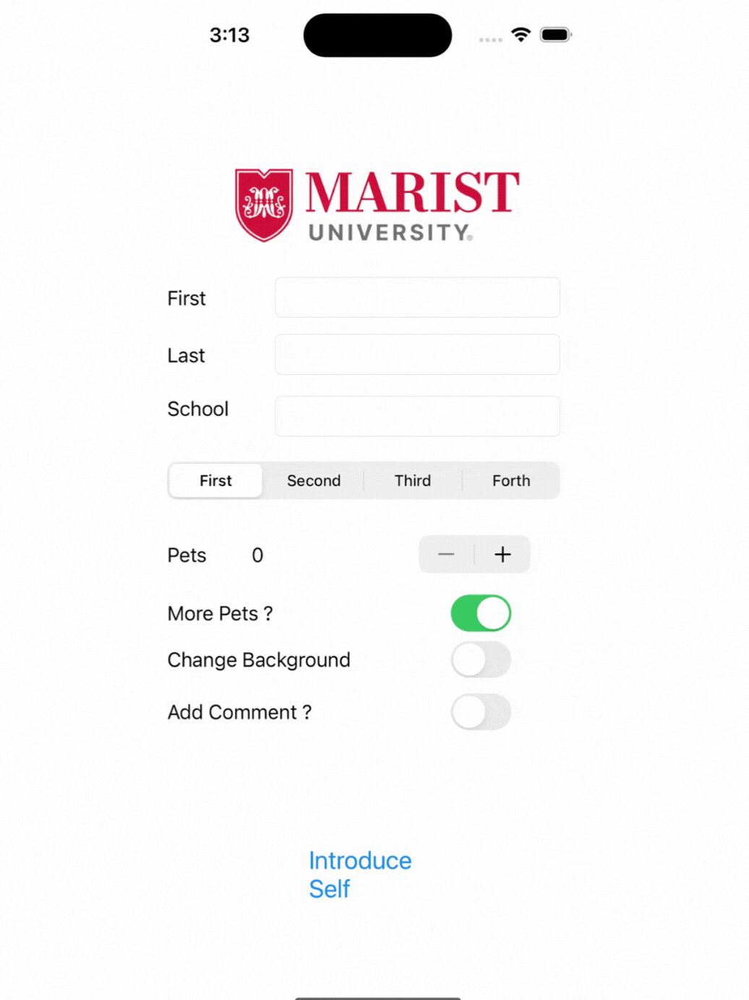

# CodePath
# Student Profile App  

## App Description  
This app allows users to create a simple student profile by entering their personal details such as first name, last name, and school name. Users can select their year of study, indicate their interest in pets, and even customize the app’s look with optional features.  

---

## App Walkthrough  

  
*(Replace `URL_TO_YOUR_GIF_HERE` with the path to your uploaded walkthrough gif.)*  

---

## Required Features  

- [x] App displays an image of a school's logo  
- [x] App has three textfields for first, last, and school names  
- [x] App has a segmented control that changes student year  
- [x] Number of pet matches label is increased/decreased by stepper  
- [x] Switch makes a statement about wanting more pets or not (true/false)  
- [x] Introduce yourself button shows alert box with an introduction and dismiss button  

---

## Optional Features  

- [x] User can tap a button to change the color of the background view  
- [x] User can select additional buttons that provide more info about the user (Example: more textfields, different alert box, etc.)  
- [x] Any stylistic changes beyond the default options  

---

## How to Run  
1. Clone this repository:  
   ```bash
   git clone https://github.com/abhijeet1999/CodePath.git
